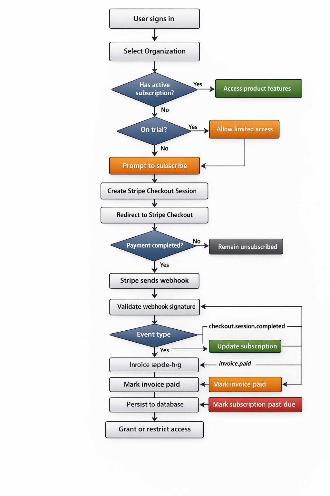
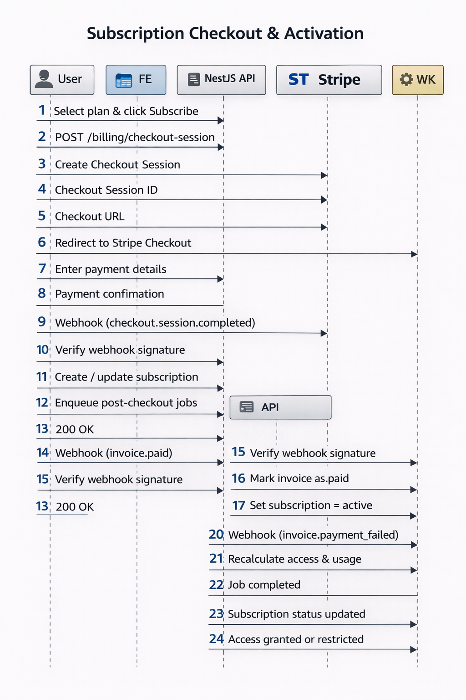
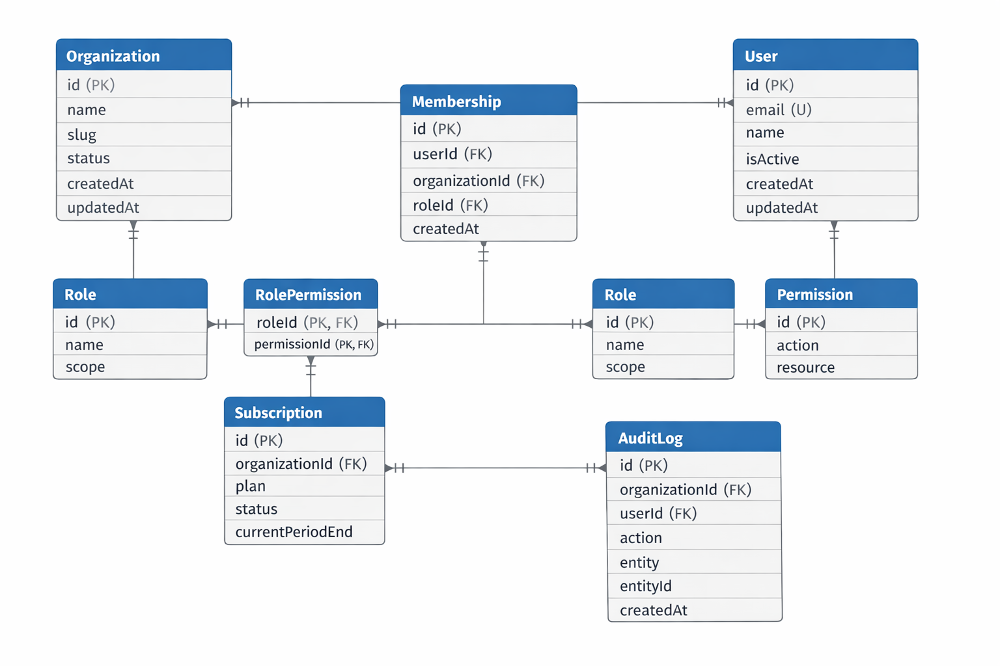

# NOBill System Architecture

This document provides a **high-level overview** of the architecture for **NOBill**, our multi-tenant SaaS billing platform. It illustrates the main components, their interactions, and external integrations like Stripe.

---

## 1. High-Level Architecture

### Legend (Color Tags)

- 🟦 **Blue:** Frontend and API Gateway (Next.js, BFF)
- 🟩 **Green:** NestJS Monolith and Modules (Auth, Org/Tenant, Billing, Usage, Webhook, Audit Log, Worker)
- 🟧 **Orange:** Database and Caching Layer (PostgreSQL, Redis)
- 🟪 **Purple:** External SaaS services (Stripe)

---

## 2. Key Components

1. **Next.js (App Router)** 🟦

   - Frontend interface for Admins and Members
   - Handles page rendering and API requests

2. **API Gateway (BFF)** 🟦

   - Routes requests from the frontend to NestJS modules
   - Handles JWT authentication and role-based access control

3. **NestJS Monolith** 🟩

   - Modular backend architecture:
     - Auth Module
     - Org/Tenant Module
     - Billing Module
     - Usage Module
     - Webhook Module
     - Audit Log Module
   - Worker (BullMQ) handles async background jobs

4. **PostgreSQL** 🟧

   - Stores tenants, users, subscriptions, usage, and audit logs

5. **Redis** 🟧

   - Caching layer for fast reads
   - Queue system for background jobs

6. **Stripe** 🟪
   - Handles payment processing, subscription lifecycle, and usage billing

---

## 3. Key Design Principles

- **Multi-Tenancy:** Row-level scoping with `orgId`, no shared mutable data
- **Idempotency & Reliability:** Webhooks and background jobs are retry-safe
- **Scalability:** Stateless API servers, horizontal scaling-ready
- **Security:** JWT authentication, role-based access control, webhook verification

---

## 4. System Flow Overview

This flowchart illustrates the **main user actions and system processes**, showing how data moves between frontend, API Gateway, backend modules, database, caching layer, and Stripe.

---

## 5. Sequence of Operations

This sequence diagram provides a **step-by-step view of key interactions**, such as:

1. User selecting a subscription plan
2. Frontend requesting a checkout session
3. Stripe processing the payment
4. Webhooks updating subscription status
5. Async background jobs updating usage and audit logs

---

## 6. ERD - NOBill Database

This Entity-Relationship Diagram (ERD) shows the **database structure for NOBill**, including all tables, primary keys, foreign keys, and relationships:

- **Organization** ↔ **User** via **Membership** (multi-tenant support)
- **Role** ↔ **Permission** via **RolePermission** (Role-Based Access Control)
- **Organization** ↔ **Subscription** ↔ **UsageRecord** (billing & usage tracking)
- **AuditLog** captures all user and organization actions for auditing

---
